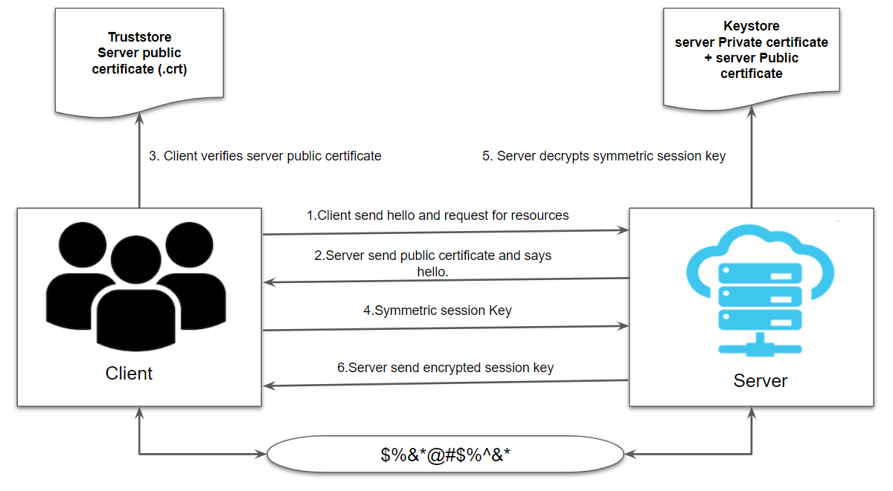
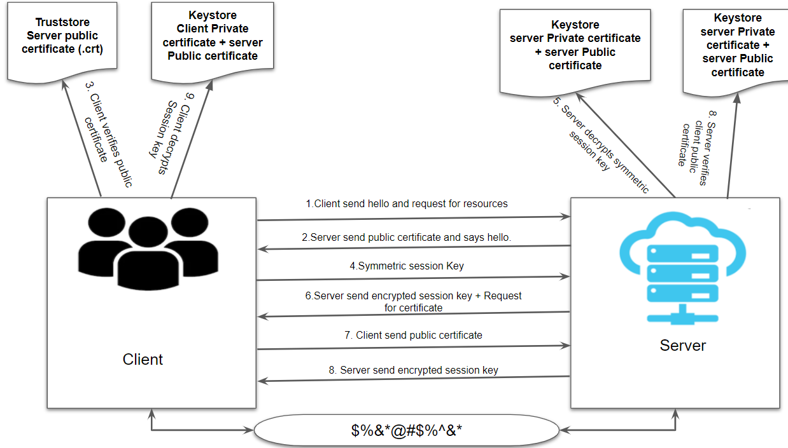

= TLS in Spring Boot
:toc:
:toc-title: Table of Content
:toclevels: 4

toc::[]

== Introduction

SSL (Secure Sockets Layer) and its successor, TLS (Transport Layer Security), are protocols for establishing authenticated and encrypted links between networked computers.
Although the SSL protocol was deprecated with the release of TLS 1.0 in 1999, it is still common to refer to these related technologies as “SSL” or “SSL/TLS”.
The most current version is TLS 1.3, defined in RFC 8446 (August 2018).

== Spring boot configuration
Property: ssl.client-auth: NONE|WANT|NEED (are not case-sensitive)

* NONE:Client authentication is not wanted.
* WANT:Client authentication is wanted but not mandatory.
* NEED:Client authentication is needed and mandatory.

== One-way authentication

.Only server is authenticated by a client (3rd step)

* Client (HTTPS)
* Server (HTTPS)
** client-auth: none|want

*Client: HTTPS*

.application.yml:
* Client need keystore to hold client certificate for running application over HTTPS.
----
ssl:
    enabled: true
    client-auth: none|want
    key-store: <path to keystore>
    key-store-password: <keystore password>
----

.VM options:
* Client need truststore to hold server certificate(s), used to validate server in SSL/TLS handshake.
* Note: Adding truststore information in the server.ssl is not effective in this case.
----
-Djavax.net.ssl.trustStore=<path to truststore>
-Djavax.net.ssl.trustStorePassword=<truststore password>
----

*Server: HTTPS*

.application.yml:
* Server need keystore to hold server certificate to share with the client for SSL/TLS handshake.
----
ssl:
    enabled: true
    client-auth: none|want
    key-store: <path to keystore>
    key-store-password: <keystore password>
----

.VM options:
----
NO VM OPTION REQUIRED
----

== Two-way authentication (mutual authentication)

.Both client and server will authenticate each other (3rd and 8th step)

* Client (HTTPS)
* Server (HTTPS)
** client-auth: need

*Client: HTTPS*

.application.yml:
* Client need keystore to hold client certificate to share with the server for SSL/TLS handshake.
* Client need truststore to hold server certificate to validate server in SSL/TLS handshake.
----
ssl:
    enabled: true
    client-auth: none|want|need
    key-store: <path to keystore>
    key-store-password: <keystore password>
    trust-store: <path to truststore>
    trust-store-password: <truststore password>
----

.VM options:
* Client need *truststore* to hold server certificate(s), used to validate *server* in SSL/TLS handshake.
* Client need *keystore* to hold client certificate(s), used to validate *client* in SSL/TLS handshake.
* Note: Adding truststore and keystore information in the server.ssl is not effective in this case.
----
-Djavax.net.ssl.trustStore=<path to truststore>
-Djavax.net.ssl.trustStorePassword=<truststore password>
-Djavax.net.ssl.keyStore=<path to keystore>
-Djavax.net.ssl.keyStorePassword=<keystore password>
----

*Server: HTTPS*

.application.yml:
* Server need keystore to hold server certificate to share with the client for SSL/TLS handshake.
* Server need truststore to hold client certificate to validate client in SSL/TLS handshake.
----
ssl:
    enabled: true
    client-auth: need
    key-store: <path to keystore>
    key-store-password: <keystore password>
    trust-store: <path to truststore>
    trust-store-password: <truststore password>
----

.VM options: (This is needed in case server is also communicating with client)
* Server need *truststore* to hold client certificate(s), used to validate *client* in SSL/TLS handshake.
* Server need *keystore* to hold server certificate(s), used to validate *server* in SSL/TLS handshake.
* Note: Adding truststore and keystore information in the server.ssl is not effective in this case.
----
-Djavax.net.ssl.trustStore=<path to truststore>
-Djavax.net.ssl.trustStorePassword=<truststore password>
-Djavax.net.ssl.keyStore=<path to keystore>
-Djavax.net.ssl.keyStorePassword=<keystore password>
----